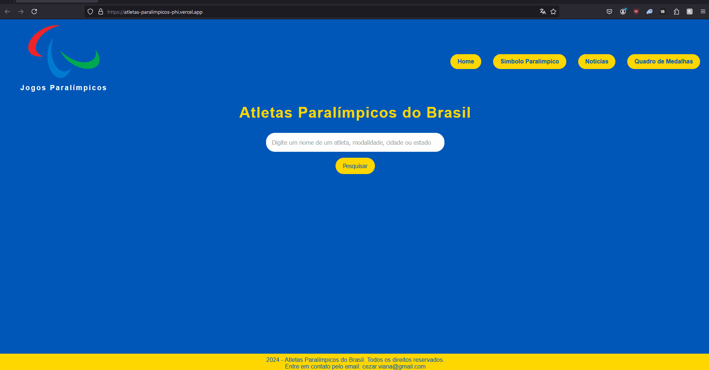
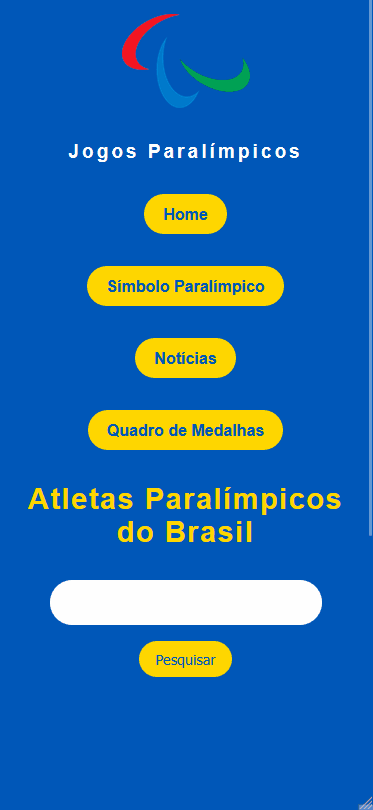

# ⚡ Projeto Atletas Paralímpicos

## 📝 Descrição do Projeto
Este projeto web tem como objetivo criar um diretório de atletas paralímpicos brasileiros, permitindo a pesquisa por nome, modalidade, local de nascimento, biografia, conquistas e tags.

Acesse o site aqui: [atletas paralímpicos](https://atletas-paralimpicos-phi.vercel.app/)


## 🔎 Funcionalidades
- Responsivo para todos os dispositivos
- Detalhes do Atleta: Ao clicar no nome do atleta, o usuário é direcionado para a página oficial do atleta no site do Comitê Paralímpico Brasileiro (CPB).
- Links para redes sociais: Quando disponível, o perfil do Instagram do atleta é fornecido.
- Obter o valor digitado no campo de`pesquisar()`. Permite realizar buscas por palavras-chave em diversos filtros em `app.js`:
- - `titulo`: Nome completo do atleta.
- - `retrato`: URL da imagem do atleta.
- - `modalidade`: Modalidade esportiva.
- - `localDeNascimento`: Local de nascimento.
- - `biografia`: Breve biografia do atleta.
- - `conquistas`: Principais conquistas.
- - `link`: Link para a página oficial do atleta no CPB.
- - `redeSocial`: Link para o perfil do Instagram do atleta (se disponível).
- - `tags`: Palavras-chave para facilitar a pesquisa.
- Iterar sobre o array de atletas.
- Verificar se o valor digitado está contido em algum dos campos do objeto atleta (título, modalidade, local de nascimento, biografia, conquistas ou tags).
- Se houver correspondência, o atleta é adicionado à lista de resultados.
- A lista de resultados é exibida na seção `resultados-pesquisa`.


## 🛠️ Ferramentas utilizadas
- **HTML:** Estruturação do projeto
- **CSS:** Estilização do projeto, responsivo
- **JavaScript:** Campos de busca, procura e entrega dos itens buscados em tela
- **Git:** Ferramenta de versionamento


## 🎨 Imagens do projeto

<div align="center">
  
<br><br>

</div>

## 💡 Decisões do projeto
1. **Tema**
- Os atletas paralímpicos, infelizmente, não possuem uma cobertura grande da mídia. Porém, são uma fonte inspiração e superação para qualquer um que os veja. Tendo isso em mente, acreditei que seria um tema muito interessante para desenvolver esse projeto e uma pequena homenagem a esses atletas fantásticos.

2. **Adicionar uma página para o símbolo paralímpico**
- Como curiosidade inclui um breve texto sobre o símbolo dos jogos paralímpicos.

## 💦 Dificuldades do projeto
- Criar um banco de atletas em Local Storage a partir do site do Comitê Paralímpico Brasileiro (CPB): Como não conhecia nenhuma API com o banco de dados dos atletas, tive que criar uma. O que se apresentou muito trabalhoso. Infelizmente, não consegui adicionar todos os atletas participantes. Mas tentei incluir atletas de todos os estados da federação, e das mais diversas modalidades.
- Campos de pesquisas: fazer um campo de `pesquisar()`, permitindo a pesquisa por nome, modalidade, local de nascimento, biografia, conquistas e tags.
- Utilizar o JavaScript para apresentar os atletas em um `campo-de-resultados`.


## 🔓 O que eu aprendi
- Como fazer um local storage (Melhorar, colocar em JSON).
- Fazer um campo de `pesquisar()` para o local storage.
- Apresentar resultados em tela, através de um `campo-de-resultados`.
- Conheci mais sobre as paralímpiadas, e sobre modalidades que não sabia que existiam. Muito interessante, pretendo acompanhar mais as próximas.


## 💭 Possíveis atualizações futuras
- Finalizar o README ✅
- Melhorar o sistema de local storage (mudar para JSON)
- Aprimorar o design responsivo para garantir uma experiência ainda melhor em diferentes dispositivos
- Aumente a base de dados de atletas para tornar o projeto mais completo
- Melhorar a acessibilidade, seguindo as diretrizes de acessibilidade web


## 🚀 Como rodar o projeto
Siga os passos abaixo para executar o projeto na sua máquina:

### Pré requisitos

- <strong><i>Git</i></strong>: Para clonar o repositório.


1. Abra o git, e execute os seguintes comandos
2. **Clonar o repositório:**
   ```bash
   git clone https://github.com/cezarviana/atletas-paralimpicos.git
   ```
3. npm install
4. npm run dev
5. **Abrir o arquivo index.html:** Abra o arquivo `index.html` em um navegador web.
